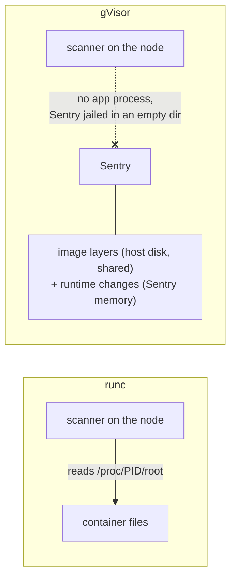
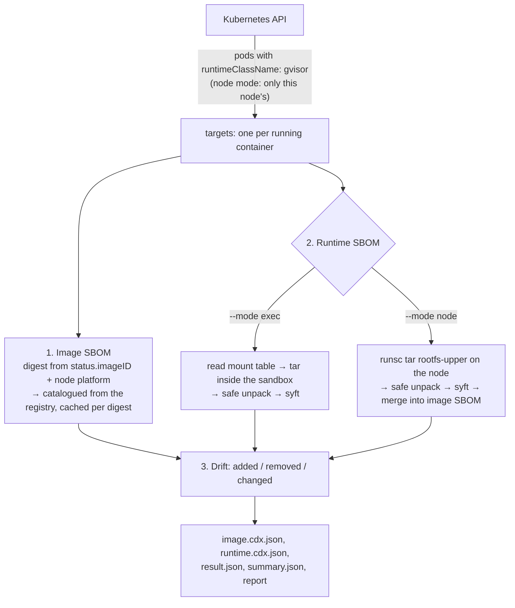
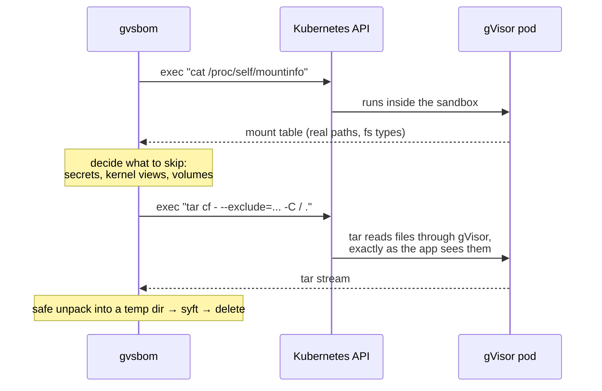
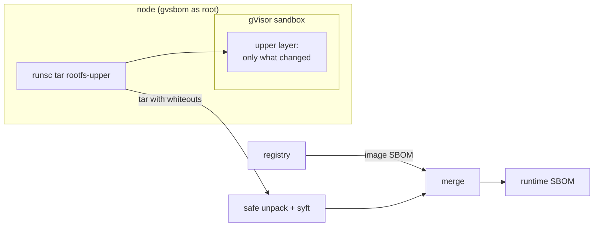
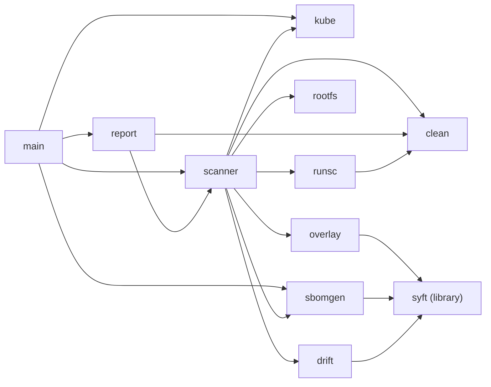

# gvsbom

Extracts SBOMs from Kubernetes pods that run under [gVisor](https://gvisor.dev), and reports what changed in each container since it started.

```
CONTAINER                 IMAGE PKGS  RUNTIME PKGS  ADDED  REMOVED  CHANGED  STATUS
default/demo/app          95          100           5      0        0        drift
default/demo-change/app   95          94            0      1        1        drift
default/demo-notar/pause  0           0             0      0        0        ok

default/demo/app
  image:   docker.io/library/python@sha256:ddb0207a...78fe74c (linux/arm64)
  + certifi 2026.7.22 (python)
  + charset-normalizer 3.5.2 (python)
  + idna 3.20 (python)
  + requests 2.34.2 (python)
  + urllib3 2.8.0 (python)

default/demo-change/app
  - netbase 6.5 (deb)
  ~ pip 25.0.1 -> 24.0 (python)
```

**Contents:** [The problem](#the-problem) · [Quick start](#quick-start) · [How it works](#how-it-works) · [Repository structure](#repository-structure) · [What we found, and how we handled it](#what-we-found-and-how-we-handled-it) · [Security model](#security-model) · [Reference](#reference) · [Limitations](#limitations) · [Reproducing it locally](#reproducing-it-locally) · [End-to-end tests](#end-to-end-tests) · [Development](#development) · [Roadmap](#roadmap)

## The problem

An SBOM (software bill of materials) lists the packages inside a piece of software. For a container there are two answers: what was **shipped** (the image) and what is **running** (the image plus anything installed or changed since it started). The second is the hard one under gVisor.

With the default runtime, **runc**, a container is an ordinary host process. A node agent can read its files through `/proc/<pid>/root`, or scan its overlayfs mount.

**gVisor** (`runsc`) runs the workload inside the **Sentry**, a Linux kernel implemented in user space, one per pod:



- The container's processes are tasks inside the Sentry, not host processes.
- The Sentry itself is jailed in an almost empty directory, so even its own `/proc/<pid>/root` shows nothing useful.
- Files written at runtime live in the Sentry's own overlay (memory, or one opaque file on the host), not as files on the host.
- The image layers **are** still on the host. So a host-side scan of a gVisor pod **does not fail**: it returns the image's packages and silently misses everything added at runtime.

The only ways to see the running state go **through gVisor**: run a command inside the sandbox (`kubectl exec`), or ask runsc on the node to export the sandbox's changes. gvsbom does both, as two modes.

## Quick start

```bash
make build
```

Exec mode, from anywhere with a kubeconfig:

```bash
./bin/gvsbom -n default
```

Node mode, on a node, as root (build with `make build-linux ARCH=arm64` or `ARCH=amd64`):

```bash
sudo ./gvsbom-linux-amd64 --mode node --node "$(hostname)" -A
```

## How it works

### The flow



1. **Image SBOM.** The container status gives the exact digest it runs (`status.containerStatuses[].imageID`, not the tag, which can move). The node's OS and architecture pick the right variant of a multi-arch image. The image is catalogued straight from its registry, once per digest.
2. **Runtime SBOM**, in one of two modes, below.
3. **Drift.** The two package lists are compared: added, removed, and the same package at a different version.

### Exec mode (default)



`tar` would otherwise pack everything the container can see, including the service account token. The mount table is read first, from inside the container, because it has the real paths and filesystem types. Each mount is classified:

| Mount | Example | Copied |
|---|---|---|
| Root filesystem | image plus runtime changes | yes |
| `tmpfs` | `/tmp`, which gVisor mounts in memory | yes |
| Kernel views | `/proc`, `/sys`, `/dev` | no |
| secret, configMap, projected, downwardAPI volumes | the service account token | **never** |
| Other volumes and host-provided files | emptyDir, PVC, `/etc/hosts` | only with `--include-volumes` |

The same list is applied again while unpacking, so an excluded path never reaches disk even if the container's `tar` ignores the exclude flags. If the container cannot show its mount table, the pod spec's mount paths are used instead.

### Node mode



runsc asks the Sentry to serialise the container's overlay **upper layer**: only the files created, changed or deleted since the container started. Nothing runs inside the workload, and the workload cannot substitute its own archive.

The upper layer holds only changes, so the runtime SBOM is built by merging:

1. Start from the image SBOM.
2. Drop an image package if the file it was identified from (syft's *primary evidence*) was rewritten or deleted in the upper layer.
3. Add every package found in the upper layer.

| What the container did | What is in the upper layer | Result |
|---|---|---|
| `pip install requests` | new `requests-*.dist-info` | added |
| `dpkg -r netbase` | rewritten `/var/lib/dpkg/status` | the image's Debian packages are dropped and re-read from the new status file: `netbase` removed |
| `pip install pip==24.0` | whiteout for `pip-25.0.1.dist-info`, new `pip-24.0.dist-info` | changed 25.0.1 → 24.0 |
| a directory replaced wholesale | opaque directory marker | everything below it from the image is dropped |

### Choosing a mode

| | `--mode exec` | `--mode node` |
|---|---|---|
| Who produces the archive | the workload (its own `tar`) | gVisor |
| What is copied | the whole filesystem, minus secrets and volumes | only what changed |
| Lab, same pod | 155 MB, 6,345 entries | 20 MB, 2,053 entries |
| Needs in the image | `tar` (and `cat`) | nothing |
| Covers `/tmp` and data volumes | yes (`--include-volumes` for volumes) | no, reported as `not covered` |
| Can the pod fake its SBOM | yes | only by first compromising gVisor |
| Runs with | `pods/exec` permission | root on each node |

Use node mode for trust, size and distroless images; use exec mode when `/tmp` and volumes must be covered.

## Repository structure

```
.
├── main.go                     CLI: flags, mode selection, exit codes
├── internal/
│   ├── kube/                   finds gVisor pods, reads digests, platforms and volume mounts, runs exec
│   ├── scanner/                orchestrates one container: image SBOM, runtime SBOM, drift, result.json
│   │   └── mounts.go           exec mode: parses mountinfo, decides what not to copy
│   ├── runsc/                  node mode: runs `runsc tar rootfs-upper`, validates container IDs
│   ├── rootfs/                 safe unpacking of untrusted tar streams; records whiteouts
│   ├── overlay/                node mode: merges the upper layer into the image SBOM
│   ├── sbomgen/                syft as a library: image and directory SBOMs, CycloneDX output
│   ├── drift/                  compares two package lists
│   ├── clean/                  makes workload-supplied strings safe to print
│   └── report/                 the terminal table and per-container details
├── test/e2e/                   end-to-end test: fixture pods and the script that checks them
├── Makefile                    build, build-linux, test, lint, e2e-lima
└── README.md
```



Every package has unit tests next to it. The tests that encode attacks or gVisor behaviour are named after it: `TestExtractCannotEscapeRoot`, `TestExtractExcludesNeverTouchDisk`, `TestExtractRecordsWhiteouts`, `TestParseMountinfoDropsUntrustedPaths`, `TestPlanFromSpecCoversVarRunAlias`, `TestClassifyExecError`, `TestMerge`.

## What we found, and how we handled it

Everything below was observed in a local lab (k3s + gVisor `release-20260928.0` on an arm64 Ubuntu VM), not assumed.

### Seeing the problem

| What we saw | Why it matters | How it's handled |
|---|---|---|
| For an identical runc pod, the host saw the app process and `/proc/<pid>/root` showed every file, including `requests`. For the gVisor pod, the host saw only `gvisor_sentry`, `runsc-gofer` and the shim, and the Sentry's `/proc/<pid>/root` contained only `etc` and `proc`. | Host-side scanning, the usual approach, cannot see a gVisor container's runtime state. | Both modes read through gVisor: exec mode runs `tar` inside the sandbox; node mode asks runsc to export. |
| `pip install` at runtime added 5 packages (`requests` and 4 dependencies) that the image SBOM does not contain. | An image-only scan would miss them, including any CVEs in them. | Drift is reported per container; `--fail-on-drift` turns it into an exit code for CI. |

### Exec mode

| What we saw | Why it matters | How it's handled | Where |
|---|---|---|---|
| The first version copied `/run/secrets/kubernetes.io/serviceaccount/token`, a live credential, onto the scanner's machine. | `tar` packs everything the container can see; the SBOM needs none of it. | Mounts are classified and secret-type volumes are never copied; the exclude list is enforced again while unpacking. | `scanner/mounts.go`, `rootfs` |
| The pod spec mounts the token at `/var/run/secrets/...`, but inside the container it is at `/run/secrets/...`, because `/var/run` is a symlink. | Excluding the spec path literally would have copied the token anyway. | The mount table is read from inside the container, where paths are already resolved. The pod-spec fallback excludes both spellings. | `TestPlanFromSpecCoversVarRunAlias` |
| gVisor mounts `/tmp` as a separate in-memory `tmpfs`. | `tar --one-file-system` would skip it, and `/tmp` is a common place to drop tools. | Mounts are classified by type rather than skipped wholesale: `tmpfs` is copied. | `planExclusions` |
| Software installed onto an emptyDir (`six` in `/opt/venv`) is invisible when volumes are skipped. | Volumes can hold software, but also databases and customer data. | Volumes are skipped by default; `--include-volumes` copies them, never secret-type ones. | `TestPlanExclusionsIncludeVolumesKeepsSecretsOut` |
| A pod without `tar` (`pause`) failed with gVisor's own wording, `error finding executable "tar"`, which differs from runc's `executable file not found`. | The first version showed a raw internal error instead of a clear status. | Both wordings are recognised, and the container is reported as `image only` with a hint to use node mode. | `TestClassifyExecError` |

### Node mode

| What we saw | Why it matters | How it's handled | Where |
|---|---|---|---|
| `runsc tar rootfs-upper` exported 14–20 MB (the 14 MB export took 0.03 s), against 155–163 MB through `tar`. | Less data from an untrusted source, and much faster. | Node mode copies only the upper layer and takes the rest from the registry. | `runsc`, `overlay` |
| runsc writes the **first** deleted path as a `0:0` character device and every **later** deletion as a **hard link to it**. | The first version only recognised the device, so a downgraded pip appeared twice, old and new. | A hard link to a recorded whiteout is a whiteout too. | `TestExtractRecordsWhiteouts` |
| `/tmp` and volumes are not part of the upper layer, so a pod with software in both first came back as plain "no drift". | That is exactly the silent miss this tool exists to prevent. | Node mode reports `not covered: /tmp …` and each non-secret volume, and says "no drift in the container's root filesystem". | `notCoveredInNodeMode` |
| runsc prints a status line when it exports. | Mixed into a stream, it would corrupt the archive. | The archive is written to a file in a private temp directory, then read. | `runsc.RootfsUpper` |
| Node mode on the `pause` pod (no `tar`) produced a runtime SBOM. | Distroless containers no longer fall back to "image only". | No requirement on the image in node mode. | |

### Untrusted input

| What we saw | Why it matters | How it's handled | Where |
|---|---|---|---|
| A crafted archive can name entries `../../x`, `/abs`, or go through a symlink to outside the copy. | A malicious pod could write onto the scanner's machine. | All writes go through Go's `os.Root`; `..` and absolute paths are clamped; device files are dropped. | `TestExtractCannotEscapeRoot` |
| Archives can be huge, or contain millions of empty files, or stream forever. | Disk, inodes or time exhausted. | `--max-rootfs-mb`, `--max-entries`, and a per-container `--timeout`; the temp copy is always removed. | `TestExtractSizeLimit`, `TestExtractEntryLimit` |
| The copy kept execute and setuid bits. | A kept copy (`--keep-rootfs`) held runnable malware. | Every file is written `0644`. We checked syft's source (it identifies binaries by content) and confirmed the same packages, including the `python` binary, are still found. | `TestExtractRegularTree` |
| A planted package named `evil<ESC>[2K<ESC>[1A<CR>  + totally-harmless` would erase the previous line in the terminal and print a fake one, and `<ESC>[8m` hides what follows. | Terminal and log injection from package metadata. | Every string printed is stripped of control and bidi characters and length-capped; the live report contained 0 escape bytes. | `clean`, `TestString` |
| The same planted name is in `runtime.cdx.json`, JSON-escaped. | The scanner keeps SBOMs faithful, so consumers receive attacker-controlled text. | Documented: SBOM consumers must validate. A gateway that rebuilds SBOMs from checked fields is on the roadmap. | |
| A fake `cat` in the pod can return any mount table. | It could inject odd paths or thousands of entries. | Only clean absolute paths are accepted; more than 256 mounts falls back to the pod spec. | `TestParseMountinfoDropsUntrustedPaths` |
| Container IDs from the API end up as `runsc` arguments. | Argument injection on the node. | Only `containerd://` followed by 64 hex characters is accepted. | `TestContainerID` |

### Smaller things

- **pip ships Windows launcher `.exe` files** inside itself, which syft reports as 7 "Simple Launcher" binaries. They are in both SBOMs, so they cancel out in the drift.
- **Directory scans and image scans use different catalogers by default** in syft, which would show spurious drift (for example `requirements.txt` files). The runtime copy is catalogued with the image catalogers, so the two SBOMs are comparable.
- **syft needs a sqlite driver registered** to read newer RPM databases when used as a library; `sbomgen` imports `modernc.org/sqlite` for that.

## Security model

- **The pod is untrusted.** Its files are unpacked so nothing can escape the copy, are never executable, are size-, count- and time-limited, and are deleted after cataloguing.
- **Everything the pod produces is attacker text**, including package names, versions, mount paths and error messages. It is cleaned before printing.
- **SBOM files are faithful, not sanitised.** Whatever consumes them must treat them as untrusted.
- **syft parses attacker-controlled files.** Run the scanner unprivileged, with CPU, memory and disk limits, ideally itself in a gVisor sandbox with no network beyond the Kubernetes API and the registry.
- **Exec mode needs `pods/exec`,** which allows running any command in any pod the scanner can see. Scope its service account to the namespaces it scans and audit exec calls. In exec mode the workload controls `tar`, so a compromised pod can hide from its runtime SBOM.
- **Node mode needs root on the node** and never runs anything in a workload. gVisor produces the archive, and mounted secrets are never part of it.

## Reference

### Flags

| Flag | Default | Meaning |
|---|---|---|
| `-n`, `--namespace` | kubeconfig namespace | namespace to scan |
| `-A`, `--all-namespaces` | false | scan every namespace |
| `--pod` | | scan only this pod |
| `--runtime-class` | `gvisor` | runtime class name that selects gVisor pods |
| `--mode` | `exec` | `exec` or `node` |
| `--node` | `$NODE_NAME` | node mode: the node this scanner runs on |
| `--runsc` | `runsc` | node mode: path to the runsc binary |
| `--runsc-root` | `/run/containerd/runsc/k8s.io` | node mode: runsc state directory used by the containerd shim |
| `--kubeconfig`, `--context` | `$KUBECONFIG`, `~/.kube/config` | cluster to use |
| `-o`, `--output-dir` | `sbom-output` | where SBOMs and results go |
| `--max-rootfs-mb` | 4096 | stop copying a container filesystem larger than this |
| `--max-entries` | 500000 | stop copying a container filesystem with more entries than this |
| `--timeout` | 10m | give up on one container after this long |
| `--skip-image`, `--skip-runtime` | false | build only one of the two SBOMs (node mode always needs the image SBOM) |
| `--keep-rootfs` | false | keep the copied filesystem next to the SBOMs |
| `--include-volumes` | false | exec mode: also copy data volumes; secret-type volumes are never copied |
| `--fail-on-drift` | false | exit with code 3 when a container differs from its image |
| `--json` | false | print results as JSON instead of a table |

### Output

```
sbom-output/
├── summary.json                      every container's result
└── <namespace>/<pod>/<container>/
    ├── image.cdx.json                CycloneDX SBOM of the image
    ├── runtime.cdx.json              CycloneDX SBOM of the running container
    └── result.json                   drift, what was not copied or not covered, warnings, errors
```

Report statuses: `drift`, `ok`, `image only` (exec mode could not read the container), `error`.

Exit codes: `0` success, `1` a container could not be scanned, `2` bad flags, `3` drift found with `--fail-on-drift`.

### Permissions

`get`/`list` on `pods` and `get` on `nodes` (for the platform; without it the registry default is used). Exec mode also needs `create` on `pods/exec`. Node mode needs root on the node and access to the runsc binary and its state directory. Registry credentials come from the local Docker config.

## Limitations

- **Exec mode needs `tar` in the container.** Distroless and scratch images get an image SBOM only; use node mode for them.
- **Node mode covers only the container's root filesystem.** `/tmp` and volumes are reported as `not covered`.
- **Node mode as a DaemonSet is untested.** It was tested by running the binary directly on a k3s node as root.
- **A runtime SBOM is a point-in-time snapshot.** Short-lived pods may be gone before they are scanned.
- **It inventories files, not what is loaded.** A package on disk that is never imported still shows up; gVisor's Runtime Monitoring would be needed to see what is actually used.
- **Deletions are seen only through package-manager records.** A removed package shows up as removed when its metadata (dpkg status, `dist-info`, …) changes.

## Reproducing it locally

gVisor runs only on Linux, so on a Mac the lab is a small Ubuntu VM running k3s (a single-node Kubernetes) with gVisor. These steps go from a clean Mac to a passing end-to-end test. They were tested on Apple Silicon with Lima 2.2.1, Ubuntu 24.04, gVisor `release-20260928.0` and k3s v1.36.5.

**Prerequisites on the Mac:** [Homebrew](https://brew.sh), Go 1.27 or later, and `make`.

**1. Create the VM** (on the Mac):

```bash
brew install lima
limactl start --name=gvisor-lab --cpus=2 --memory=4 --disk=20 --containerd=none --tty=false template:ubuntu-24.04
```

**2. Open a shell inside it.** Steps 3 to 6 run inside the VM.

```bash
limactl shell gvisor-lab
```

**3. Install gVisor** from its signed apt repository, plus `jq`, which the end-to-end test uses:

```bash
sudo apt-get update && sudo apt-get install -y ca-certificates curl gnupg jq
curl -fsSL https://gvisor.dev/archive.key | sudo gpg --dearmor -o /usr/share/keyrings/gvisor-archive-keyring.gpg
echo "deb [arch=$(dpkg --print-architecture) signed-by=/usr/share/keyrings/gvisor-archive-keyring.gpg] https://storage.googleapis.com/gvisor/releases release main" | sudo tee /etc/apt/sources.list.d/gvisor.list
sudo apt-get update && sudo apt-get install -y runsc
runsc --version
```

**4. Install k3s:**

```bash
curl -sfL https://get.k3s.io | sudo INSTALL_K3S_EXEC="--write-kubeconfig-mode=644" sh -
```

**5. Register runsc with k3s's containerd**, through a drop-in file so k3s's generated config is left alone:

```bash
sudo mkdir -p /var/lib/rancher/k3s/agent/etc/containerd/config-v3.toml.d
sudo tee /var/lib/rancher/k3s/agent/etc/containerd/config-v3.toml.d/runsc.toml <<EOF
[plugins."io.containerd.cri.v1.runtime".containerd.runtimes.runsc]
  runtime_type = "io.containerd.runsc.v1"
EOF
sudo systemctl restart k3s
sudo k3s kubectl wait --for=condition=Ready node --all --timeout=120s
```

The plugin name depends on the containerd config version: check the top of `/var/lib/rancher/k3s/agent/etc/containerd/config.toml`. `version = 3` uses `io.containerd.cri.v1.runtime` as above; `version = 2` uses `io.containerd.grpc.v1.cri`.

**6. Create the RuntimeClass** that makes `runtimeClassName: gvisor` mean "run with runsc", then leave the VM:

```bash
cat <<EOF | sudo k3s kubectl apply -f -
apiVersion: node.k8s.io/v1
kind: RuntimeClass
metadata:
  name: gvisor
handler: runsc
EOF
exit
```

**7. Run the end-to-end test** (on the Mac, from this repository). It builds the Linux binary and runs `test/e2e/run.sh` inside the VM as root:

```bash
make e2e-lima
```

It should end with `passed: 32, failed: 0` after about a minute. The fixture pods install packages from PyPI, so the VM needs internet access.

**Running gvsbom by hand** against the lab:

- Exec mode from the Mac: copy the kubeconfig out of the VM (Lima forwards port 6443 to `127.0.0.1`), then point gvsbom at it.

  ```bash
  limactl shell gvisor-lab sudo cat /etc/rancher/k3s/k3s.yaml > lab.kubeconfig
  ./bin/gvsbom --kubeconfig lab.kubeconfig -A
  ```

- Node mode inside the VM: the VM sees the Mac's home folder at the same path.

  ```bash
  make build-linux ARCH=arm64
  limactl shell gvisor-lab sudo "$PWD/bin/gvsbom-linux-arm64" --mode node --node lima-gvisor-lab --kubeconfig /etc/rancher/k3s/k3s.yaml -A
  ```

**Removing the lab** (on the Mac):

```bash
limactl delete --force gvisor-lab
```

The pods used to produce the findings above:

| Pod | What it does | Shows |
|---|---|---|
| `demo` | `pip install requests` after start | runtime additions |
| `demo-change` | `dpkg -r netbase`, `pip install pip==24.0` | removals and version changes |
| `demo-notar` | `registry.k8s.io/pause`, no `tar` | the distroless case |
| `demo-vol` | a secret, `six` on an emptyDir, `colorama` in `/tmp` | what is copied, skipped and not covered |
| `demo-runc` | same as `demo`, default runtime | the host can read runc containers but not gVisor ones |
| `demo-evil` | a package name with terminal escape codes | output cleaning |

## End-to-end tests

`test/e2e/run.sh` deploys fixture pods with known, pinned runtime changes into the `gvsbom-e2e` namespace, runs gvsbom in both modes with `--json`, checks the results, and deletes the namespace. It runs on a node with gVisor, as root, because node mode reads runsc's state, and needs `kubectl` and `jq` there. In the Lima lab (set up with the steps in [Reproducing it locally](#reproducing-it-locally)):

```bash
make e2e-lima
```

On any other gVisor node:

```bash
BIN=./gvsbom-linux-amd64 sudo -E test/e2e/run.sh
```

| Fixture | Runtime change | Checked in exec mode | Checked in node mode |
|---|---|---|---|
| `e2e-add` | pip installs 5 pinned packages | exactly those 5 added | the same 5 added |
| `e2e-change` | `dpkg -r netbase`, pip 25.0.1 → 24.0 | netbase removed, pip changed | the same, pip not listed twice |
| `e2e-notar` | none; no `tar` in the image | `image only`, no errors | a runtime SBOM anyway |
| `e2e-vol` | a secret, `six` on an emptyDir, `colorama` in `/tmp` | only `colorama`; token and secret excluded; with `--include-volumes` both, and the copy has no token, no secret, no executable files | `/tmp` and the emptyDir reported as not covered |
| `e2e-evil` | a package name with terminal escape codes | found, and the printed report has no escape bytes | |
| `e2e-liar` | installs `requests`, then replaces its own `tar` with one that hides it | fooled: `requests` missing | not fooled: `requests` found |
| `e2e-runc` | default runtime | never scanned | never scanned |

It also checks `--max-entries`, `--timeout`, `--fail-on-drift` (exit 3), the node-mode usage error (exit 2), and that node mode copies less than exec mode. In the lab the whole run takes about a minute: 32 checks.

Two things the suite itself taught us:

- **Checks must fail when the scan fails.** The first version of the `e2e-liar` fake `tar` was broken (GNU tar accepts the short `cf` form only as the first argument), so the scan errored and a loose "requests is not in the drift" check passed anyway. Every check now requires a real result, and each run must have scanned all 6 gVisor containers.
- **The suite catches the bugs we fixed.** With the hard-link whiteout fix removed, the node-mode `e2e-change` check fails, the same symptom we first saw by hand.

## Development

```bash
make test
```

```bash
make lint
```

`make build` builds for this machine, `make build-linux ARCH=arm64|amd64` for nodes. The binary is about 100 MB, almost all of it syft's catalogers.

## Roadmap

- **SBOM gateway:** a small service that verifies, size-limits, schema-validates and rebuilds each SBOM from checked fields before anything internal sees it.
- **Deployment manifests:** exec mode as a disposable Job in its own gVisor sandbox (non-root, read-only, memory-only scratch, default-deny network); node mode as a DaemonSet.
- **Coverage for node mode:** combine with exec mode for `/tmp` and volumes where the trade-off is acceptable.
